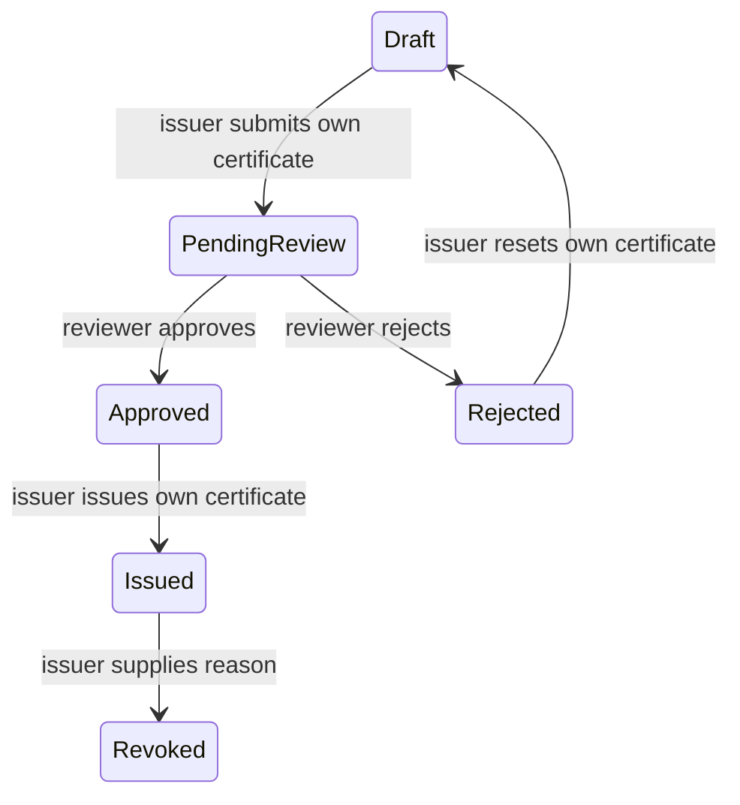

# VeriCred

Digital certificate issuance with independent review, an audit trail, and public QR verification. Built with Python, Django, SQLite, QRCode and Pillow.

## Run on Windows

Use Python 3.13 (tested). From the project folder:

```powershell
py -3.13 -m venv .venv
.\.venv\Scripts\python.exe -m pip install -r requirements-lock.txt
.\scripts\iniciar-demo.ps1
```

Open `http://127.0.0.1:8013`. The launcher migrates a new local database, creates four **synthetic** certificate samples and generates a unique password for the three demo accounts. Read the local `.demo-credentials.json` for `demo-issuer`, `demo-reviewer` and `demo-viewer`. This file, the database and generated QR images are excluded from Git.

For an empty workspace instead of a seeded demo:

```powershell
.\.venv\Scripts\python.exe manage.py migrate
.\.venv\Scripts\python.exe manage.py createsuperuser
.\.venv\Scripts\python.exe manage.py runserver 127.0.0.1:8013
```

## Workflow and authorization



- `ISSUER`: creates certificates, edits/resubmits its own drafts or rejected certificates, issues approved certificates and revokes its own issued certificates.
- `REVIEWER`: approves/rejects pending submissions. The approval records the actual reviewer and is preserved when the issuer issues the certificate.
- `VIEWER`: authenticated read access; cannot change metadata or workflow.
- `ADMIN` or superuser: all workflow actions. Set account roles under `/admin/vericore/profile/`.

Certificate changes and their audit entries commit in one database transaction. The Django admin exposes certificates and audit records for viewing; writes go through the application workflow so that they cannot bypass its validation and audit trail. Lists paginate certificates and audit entries. The detail page shows only permitted next actions.

## Verification and privacy

QR codes contain an absolute URL built from `PUBLIC_BASE_URL`. Configure that value **before creating certificates**; existing QR images are not automatically regenerated. The default origin is `http://127.0.0.1:8013` and is intended for verification on the same machine. A phone requires an accessible deployment origin.

Only issued and revoked certificates have a public verification page. Drafts, pending submissions and approvals return 404. Public pages display the recipient name, course, institution, status and certificate identifier; they omit recipient email, internal description and audit notes. The random verification token is a shareable bearer link; share it only with the intended audience when using real records. The demo uses `example.com` addresses and fictional institutions.

## Configuration

Settings read environment variables directly; `.env.example` documents them and is not loaded automatically.

| Variable | Local default / purpose |
|---|---|
| `DEBUG` | `1` for local development; set `0` in production |
| `ALLOWED_HOSTS` | Loopback hosts only; comma-separated explicit production hosts |
| `SECRET_KEY` | Local development value; production requires a unique key of at least 50 characters |
| `PUBLIC_BASE_URL` | `http://127.0.0.1:8013`; HTTPS origin required in production |
| `DATABASE_PATH` | New local `db.sqlite3`; may point to another database file |
| `MEDIA_ROOT` | Local `media/` QR output folder |
| `DEMO_PASSWORD` | Required only for manually calling `seed_demo`; launcher generates it locally |

With `DEBUG=0`, the application rejects a weak/default key, wildcard hosts or an HTTP public origin. Secure session/CSRF cookies, SSL redirect, HSTS and MIME sniffing protection are configured. Proxy HTTPS headers must be configured for the actual trusted deployment proxy; no proxy is implicitly trusted. `runserver` is a development server. A production deployment also needs a WSGI/ASGI server, static/media serving, backups and operational monitoring.

## Validation

```powershell
.\.venv\Scripts\python.exe manage.py test --verbosity 2
.\.venv\Scripts\python.exe manage.py makemigrations --check --dry-run
.\.venv\Scripts\python.exe scripts\verificar_produccion.py
```

12 tests cover the full create → review → approve → issue workflow, audit creation, role boundaries, ownership, revoked-reason validation, draft privacy, absolute QR URLs, unknown tokens, CSRF and transaction rollback on audit failure. Tests use a separate in-memory database and temporary media directories.

The dependency lock was installed and tested with Python 3.13 on Windows; `pip-audit` reported no known vulnerabilities in these pinned runtime dependencies on 2026-10-07. This scan does not replace source review or future dependency maintenance.

## Scope and next steps

VeriCred is a portfolio/demo application, not a deployed institutional service. SQLite does not provide PostgreSQL-style row locks; transaction consistency is tested, but parallel high-volume issuance needs PostgreSQL and concurrency tests. Real deployment also needs login rate limiting, retention/privacy policy and recovery procedures. No real local database or credentials are included in this source copy.
